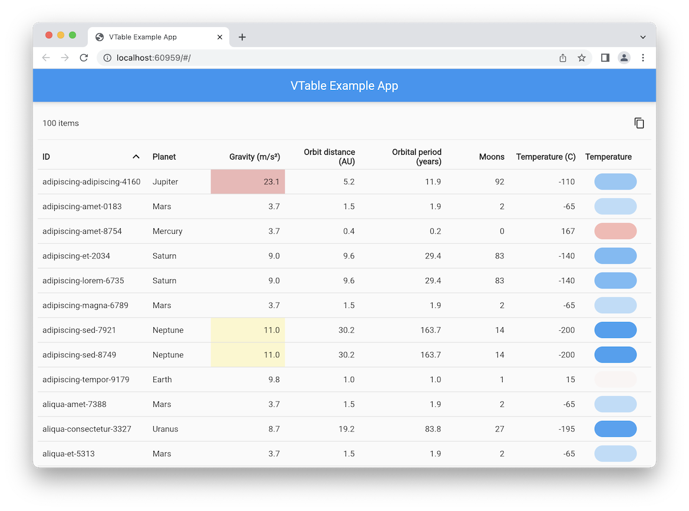

[](https://github.com/devoncarew/vtable/actions/workflows/ci.yaml)
[](https://pub.dev/packages/vtable)
[](https://pub.dev/packages/vtable/publisher)

A Flutter table widget featuring virtualization, sorting, and custom cell
rendering.

## Features

A Flutter table widget featuring virtualization, sorting, and custom cell
rendering. Features include:

- virtualization
- sorting
- custom cell rendering
- cell tooltips
- customized column widths and grow
- cell alignment
- cell validation
- custom widgets for various table areas (table summary, filtering widgets,
  action widgets)



## Getting started

From the command line:

    flutter pub add vtable

And in your project source:

    import 'package:vtable/vtable.dart';

## Usage

```dart
Widget build(BuildContext context) {
  return VTable<SampleRowData>(
    items: listOfItems,
    columns: [
      VTableColumn(
        label: 'Planet',
        width: 120,
        grow: 0.6,
        transformFunction: (row) => row.name,
      ),
      VTableColumn(
        label: 'Gravity',
        width: 100,
        grow: 0.3,
        transformFunction: (row) => row.gravity.toStringAsFixed(1),
        alignment: Alignment.centerRight,
        compareFunction: (a, b) => a.gravity.compareTo(b.gravity),
        validators: [SampleRowData.validateGravity],
      ),
    ],
  );
}
```

See also the
[main.dart](https://github.com/devoncarew/vtable/blob/main/example/main.dart)
example and the package's [API](https://pub.dev/documentation/vtable/latest/)
documentation.
